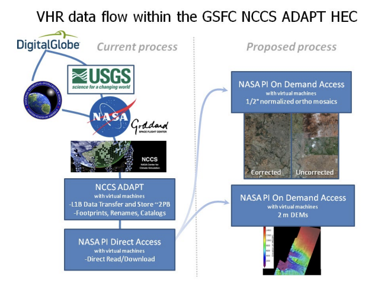

# Enhanced Very-high Resolution (EVHR) Tool

[](https://zenodo.org/doi/10.5281/zenodo.10062470)

Python library to produce on-demand user-defined science-ready (geo-referenced, ortho-rectified, top-of-atmosphere reflectance (TOA)) GeoTiffs and digital elevation models (DEMs) from spaceborne VHR images from the MAXAR archive.

## Background

Commercial very high-resolution (VHR) Earth observing (EO) satellites have grown into constellations with global
repeat coverage that can support existing NASA EO missions with stereo and multispectral capabilities. Sub-meter
data from these instruments exceeds petabytes per year and the cost for data, storage systems and compute power
have all dropped exponentially. Concurrently, through agreements with the National Geospatial-Intelligence Agency,
NASA-Goddard Space Flight Center is acquiring VHR EO imagery from MAXAR's WorldView-1, 2, 3 Quickbird-2,
GeoEye-1 and IKONOS-2 satellites. 

To enhance the utility of these data we are developing an Application Program Interface (API) to produce on-demand
user defined science ready products to support NASA's EO missions. These enhancements include two primary foci:
- surface reflectance 1/2° ortho mosaics - multi-temporal 2 m multispectral imagery that can be used to investigate
biodiversity, horizontal forest structure, surface water fraction, and land-cover land-use at the human scale
- VHR digital elevation models (DEMs) - derived with the NASA Ames Stereo Pipeline



These enhanced products benefit Earth surface studies on the cryosphere (glacier mass balance, flow rates and
snow depth), hydrology (lake/waterbody levels, landslides, subsidence) and the biosphere (vertical forest structure,
tree canopy height and cover) among others. Here we present current API capabilities and recent examples of derived
products used in NASA Earth Science projects.

## Objectives

- Improve VHR data discovery: using databases and ArcGIS mosaic datasets within NASA-GSFC’s ADAPT global archive of
DigitalGlobe VHR imagery;
- Produce on demand VHR regional mosaics: automating estimates of surface reflectance, ortho-rectifiying and
normalizing 1 m mosaics for pan and 2 m for multi-spectral; and
- Produce on demand 2 m posting DEMs: leveraging HEC processing and open source NASA-Ames Research Center Stereo
Pipeline software.

## Running EVHR

### Scripts

The following scripts serve as the drivers to run the EVHR tool.

#### scripts/run_evhr_exec: starts sing container instance, runs `run_evhr`

```bash
#!/bin/bash
singularity instance start \
	-B /explore,/panfs,/css,/nfs4m,/tmp \
	/explore/nobackup/people/iluser/ilab_containers/evhr_4.0.0.sif \
	ev_instance

singularity exec instance://ev_instance /bin/bash \
	./run_evhr $1 $2
```

#### scripts/run_evhr: runs EVHR's TOA CLV

```bash
export PYTHONPATH="/usr/local/lib/python3.8/dist-packages:/opt/DgStereo/pygeotools:/opt/DgStereo/dgtools:$PWD:$PWD/evhr:$PWD/core"

echo Starting evhr run with celery

python evhr/view/evhrToaCLV.py \
	-o $2 \
	--scenes_in_file $1

echo Done with evhr run with celery
```

### Dependencies

- evhr: git@github.com:nasa-nccs-hpda/evhr.git
- core: git@github.com:nasa-nccs-hpda/core.git

### Input

For the scripts, you should provide a .txt file where each line of the file is a path to the NTF file to process.

### Running the Tool

```bash
$ ./run_evhr_exec /path/to/input/file.txt outputdir
```

## References

[1] Neigh, C. S., Carroll, M. L., Montesano, P. M., Slayback, D. A., Wooten, M. R., Lyapustin, A. I., ... & Tucker, C. J. (2019, July). An API for spaceborne sub-meter resolution products for earth science. In IGARSS 2019-2019 IEEE International Geoscience and Remote Sensing Symposium (pp. 5397-5400). IEEE.

[2] Montesano, P., Carroll, M., Neigh, C., Macander, M., Caraballo-Vega, J., Frost, G., & Tamkin, G. (2023, July). Producing a Science-Ready Commercial Data Archive: A Workflow for Estimating Surface Reflectance for High Resolution Multispectral Imagery. In IGARSS 2023-2023 IEEE International Geoscience and Remote Sensing Symposium (pp. 2981-2984). IEEE.
